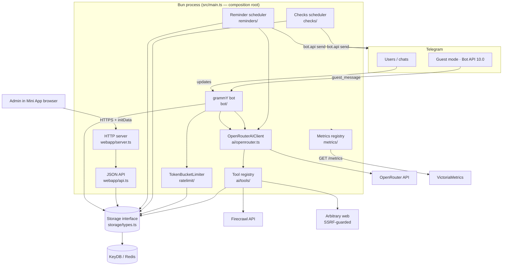
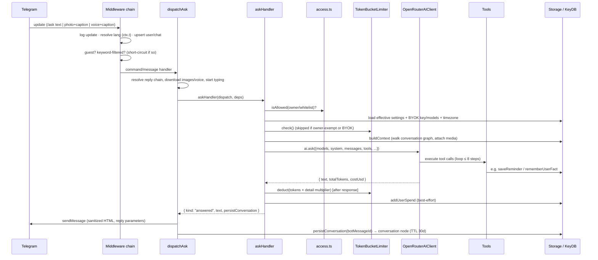
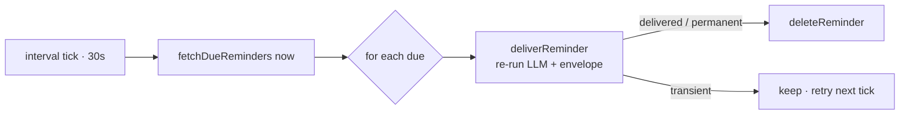

<!--
SPDX-License-Identifier: AGPL-3.0-or-later
Copyright (C) 2026 The Fisher Slopworks Co
-->

# Architecture

> Source of truth for how `any_talker` is structured. Read this before any work
> that touches architecture, adds a module, or crosses a component boundary.
> When you change the architecture, update this file in the same change (see the
> maintenance rule in `CLAUDE.md`).

## 1. Purpose

`any_talker` is a Telegram bot that answers questions with an LLM (via
OpenRouter) and layers on conversational memory, scheduled reminders, recurring
check-ins, and per-user/per-chat administration. It is operated by a single
**owner** (`BOT_OWNER_ID`) for a whitelist of users and chats; all configuration
is done from a Telegram Mini App served by the bot itself.

## 2. Overview

A single Bun process (`src/main.ts`) is the composition root. It loads config,
constructs the shared services — `KeyDBStorage`, `TokenBucketLimiter`,
`OpenRouterAIClient` — registers the AI tools, then starts four long-lived
things:

1. **The grammY bot(s)** in long-polling mode — receives Telegram updates, runs
   the `/ask` and guest-mode flows, photo/voice/contact handlers, and the
   recurring check inline-button callbacks. A `BotManager` (`managed-bots/`) runs
   **additional character bots** the owner created via the Bot API 9.6 Managed
   Bots flow — each its own token, avatar, name, system prompt, reminders and
   per-character memory, answering only when addressed as `/ask@its_username`.
2. **An HTTP server** (`Bun.serve`) — serves the React admin Mini App, a JSON
   `/api/*` surface, `GET /metrics` (Prometheus), and `GET /health`.
3. **The reminder scheduler** — polls KeyDB for due reminders and delivers them.
4. **The checks scheduler** — fires recurring daily check-ins and times them out.

Everything persists through one `Storage` interface backed by **KeyDB** (a
Redis-compatible store) in production and an in-memory double in tests. The AI
layer wraps the **Vercel AI SDK** + the **OpenRouter provider** and exposes a
registry of tools the model can call. Cross-cutting concerns (config, logging,
metrics, i18n, proxy) are small standalone modules injected where needed.

There is **no build step**: Bun executes the TypeScript directly. The React Mini
App is bundled at serve time via Bun's HTML-import mechanism + `bun-plugin-tailwind`.

Key conventions that shape the whole codebase:

- **Dependency injection** — `createBot(deps)` / `startServer(deps)` and the
  schedulers take injected `storage`, `ai`, `rateLimiter`. Handlers are pure
  functions of their inputs.
- **Tagged outcomes** — bot handlers return discriminated `{ kind: ... }` objects
  (e.g. `"answered" | "denied" | "rateLimited" | "usage" | "error"`); the
  dispatcher owns all Telegram sends by switching on `kind`. The HTTP API uses
  the parallel `{ status, body }` shape.
- **Schema-on-read** — there are no migration files; stored records are
  normalized/backfilled when read (`normalize()` for settings, Zod
  `StoredReminderSchema` for reminders, `parseCheckJson` for checks).

## 3. System diagram

## 4. Directory / module map

| Path | Responsibility | Key files |
|---|---|---|
| `src/main.ts` | Composition root: load config, wire services, register tools, start bot + HTTP + schedulers; hot-reload teardown. | `main.ts` |
| `src/config.ts` | Env-var loading & validation → `Config`. | `config.ts` |
| `src/bot/` | grammY bot, middleware chain, dispatchers, handlers, Telegram formatting. | `index.ts`, `handlers/{ask,guest,contact,check-callback}.ts`, `access.ts`, `context-builder.ts`, `format.ts`, `html.ts`, `media-group-buffer.ts` |
| `src/bot/middleware/` | Per-update middleware: language resolution, keyword auto-delete. | `lang.ts`, `keyword-filter.ts` |
| `src/ai/` | OpenRouter client, system-prompt builder, message (de)serialization, AI types. | `openrouter.ts`, `instruction.ts`, `serialize.ts`, `types.ts` |
| `src/ai/tools/` | Tool registry + `withLogging` wrapper + SSRF-safe HTTP + each tool. | `registry.ts`, `logging.ts`, `http.ts`, `search-web.ts`, `fetch-page.ts`, `calculator.ts`, `currency-convert.ts`, `youtube-transcript.ts`, `user-facts.ts`, `reminders/` |
| `src/managed-bots/` | Owner-created character bots (Bot API 9.6): lifecycle manager, persona resolver, native-creation handling, avatar + input validation. | `manager.ts`, `persona.ts`, `avatar.ts`, `validate.ts`, `types.ts` |
| `src/storage/` | `Storage` interface (+ per-character `forBot` scoping) + KeyDB impl (prod) + in-memory double (tests). | `types.ts`, `keydb.ts`, `memory.ts` |
| `src/webapp/` | HTTP server, JSON API, Telegram initData auth, OpenRouter stats proxy. | `server.ts`, `api.ts`, `auth.ts`, `openrouter-proxy.ts` |
| `src/webapp/ui/` | React + Tailwind admin Mini App (views, components, api client, i18n). | `app.tsx`, `api-client.ts`, `views/`, `components/`, `lib/` |
| `src/reminders/` | One-shot reminder scheduling, delivery (re-runs the LLM), stored-record validation. | `scheduler.ts`, `delivery.ts`, `parse.ts`, `types.ts` |
| `src/checks/` | Recurring daily check-ins: schedule math, firing, resolution, counters. | `runner.ts`, `schedule.ts`, `resolve.ts`, `counter.ts`, `validate.ts`, `format.ts`, `callback-data.ts` |
| `src/ratelimit/` | Per-user token-bucket rate limiter. | `token-bucket.ts`, `types.ts` |
| `src/spending/` | UTC-day-bucketed per-user spend windows (day/week/month). | `window.ts` |
| `src/settings.ts` | Global/per-chat settings load, normalize, and override merge. | `settings.ts` |
| `src/metrics/` | Hand-rolled Prometheus registry + every instrument. | `registry.ts`, `instruments.ts`, `index.ts` |
| `src/shared/` | i18n catalog, timezone math, display-name validation, interval scheduler, shared domain types. | `i18n.ts`, `tz.ts`, `display-name.ts`, `interval-scheduler.ts`, `types.ts` |
| `src/log.ts` · `src/proxy.ts` · `src/build-info.ts` | Structured logging, HTTP-proxy resolution, version/git metadata. | — |
| `src/types/` | Ambient declarations (Bot API 10.0 guest mode; HTML/CSS module imports). | `telegram-guest.d.ts`, `html-modules.d.ts` |

## 5. Core components

### Composition root — `src/main.ts`
Wires everything in order: `loadConfig()` → `KeyDBStorage.connect()` →
`TokenBucketLimiter` → `OpenRouterAIClient` → register tools (each wrapped in
`withLogging`) → `createBot()` → `deleteWebhook` + `syncBotCommands` →
`bot.start()` (long polling, `allowed_updates` extended with the custom
`guest_message`) → `startServer()` → `startScheduler()` + `startChecksScheduler()`.
`search_web` and `youtube_transcript` are only registered when
`FIRECRAWL_API_KEY` is set. `import.meta.hot.dispose` stops all handles on
hot-reload. **Depends on:** nearly every subsystem. **Depended on by:** nothing
(entry point).

### Bot — `src/bot/`
`createBot(deps)` builds the grammY `Bot` and registers a middleware chain whose
order is the request lifecycle (see §6). Two dispatchers convert handler outcomes
into Telegram sends:
- `dispatchAsk` — the `/ask` (`short`) and `/askwise` (`wise`) flows; resolves
  reply context, downloads images/voice, starts a typing indicator, calls
  `askHandler`, and on `"answered"` sends the formatted reply and persists the
  conversation node.
- `dispatchGuest` — Bot API 10.0 guest queries; replies once via the raw
  `answerGuestQuery` API call.

Handlers (`handlers/`) are pure and return tagged outcomes. `access.ts` is the
bot-side authorization gate (owner / user-whitelist / chat-whitelist). Outgoing
text goes through `html.ts` (whitelist HTML sanitizer) and `format.ts` (bot-name
prefix, expandable blockquote, 4096-char truncation). `createBot` is
parameterized by a `resolver` (the persona), an optional `persona` (`{botId}`),
and an optional `siblingBotIds`: when `persona` is present it is a **managed
bot** — it scopes per-character storage with `storage.forBot(botId)` and threads
`botId` into the tool call context.

**Ask routing (`matchAsk` + `askGate`).** Both are pure and matched against the
bot's live `ctx.me.username` (no stale username). `matchAsk` parses `/ask(wise)`
and returns `{detailLevel, userText, explicit}` (or null for non-ask / a mention
to a *different* bot — this is what stops the main bot stealing a
`/ask@CharacterBot` caption). `askGate` then decides: an explicit `@self` is
always answered; the main bot answers a bare `/ask` everywhere; a managed bot
answers a bare `/ask` only in its **DM**, or in a group when it is the **only
family bot present** (resolved via the presence registry, see below). Every bot
(main and managed) records its own group membership — authoritatively on
`my_chat_member`, and refreshed on genuine activity (`shouldRefreshPresence`:
content messages only, never the service/membership burst a bot drains around
its own removal) — into a shared `bot_presence` registry; `computeAlone` reads it
(TTL-pruned) to make the group decision.
Managed bots also `syncBotCommands` for their own `/ask` menu, and carry **no
bold name prefix** (a managed bot *is* the character — `resolver` returns a null
`botName`). **Depends on:** `ai`, `storage`, `ratelimit`, `settings`, `managed-bots`
(persona), `shared/i18n`, `metrics`, `checks/resolve`. **Depended on by:**
`main.ts`, `managed-bots/manager`.

### Managed bots — `src/managed-bots/`
`BotManager` owns the lifecycle of every owner-created character bot: it loads
them at boot, starts/stops individual long-polling loops as the owner creates
(via the native `managed_bot` update → `getManagedBotToken`) or deletes them, and
stops all on hot-reload. Each managed bot is a full `createBot` instance with its
own token and update stream. `persona.ts` resolves the character per turn — for a
managed bot the main bot's **global** settings with the character's own
`systemPrompt`/name substituted in (per-chat overrides deliberately ignored);
`avatar.ts` wraps `setMyProfilePhoto`; `validate.ts` mirrors the Checks input
validator. The single reminder scheduler iterates `BotManager.reminderRuntimes()`
(plus the main runtime) so each character's reminders fire from the right
identity and persona. **Depends on:** `bot`, `storage`, `ratelimit`, `ai`,
`reminders` (runtime type), `proxy`. **Depended on by:** `main.ts`, `webapp`
(admin CRUD via a narrow `ManagedBotController`).

### AI layer — `src/ai/`
`OpenRouterAIClient.ask(...)` wraps the Vercel AI SDK `generateText` + the
OpenRouter provider. It splits `models` into a primary + OpenRouter fallback
list, supports **BYOK** (a per-call `apiKey` builds a fresh provider), passes
provider routing / `service_tier` / `reasoning.effort` / `usage.include` as
provider options, maps domain messages to SDK messages (text/image/audio), and
runs the tool-calling loop bounded by `stepCountIs(8)`. It returns
`{ text, totalTokens, costUsd }`, summing per-step OpenRouter cost. `instruction.ts`
builds the (Russian) system prompt and defines the `DetailLevel` multipliers;
`serialize.ts` converts messages to/from a base64-safe form for storage inside
reminders. **Depends on:** `proxy`, `metrics`, `shared`, `storage` (via tools).
**Depended on by:** `bot`, `reminders/delivery`.

### Tools — `src/ai/tools/`
`registry.ts` defines the `Tool` contract (`name`, `description`, Zod
`parameters`, `execute(input, ctx)`) and a process-wide singleton registry.
`withLogging` (`logging.ts`) wraps every tool with structured logging + metrics.
`http.ts` provides `safeFetch` — **SSRF-hardened**: DNS-resolves to a public IP,
blocks private/loopback/link-local ranges, pins the connection to the validated
IP (defeating DNS rebinding), re-validates redirects, and allow-lists
http/https + ports 80/443. Tools: `random_number`, `random_choice`,
`calculator` (hand-written parser, no `eval`), `currency_convert`, `fetch_page`
(Readability → Markdown), `youtube_transcript` + `search_web` (Firecrawl,
concurrency-bounded by `createSemaphore`), `user_facts`, and the `reminders`
tools (which **create** reminders; firing lives in `src/reminders/`).
**Depends on:** `storage` (facts/reminders), `proxy`, `metrics`, Firecrawl/web.
**Depended on by:** `ai/openrouter` (via `getAllTools()`), `main.ts` (registration).

### Storage — `src/storage/`
`types.ts` is the single `Storage` interface (settings, whitelist, rate-limit
buckets, per-user attributes, BYOK, spending, users/chats directories, chat
settings, conversation graph, photo cache, albums, guest threads, reminders,
checks, user facts). `keydb.ts` implements it over Bun's `RedisClient`, with all
keys under the `at:` prefix and **server-side Lua (`EVAL`)** for the three
race-prone operations (bucket refill, bucket deduct, fact upsert+evict).
`memory.ts` (`MemoryStorage`) mirrors the interface for tests. **Depended on by:**
essentially everything.

### Web App — `src/webapp/`
`server.ts` runs `Bun.serve`: static routes serve the React bundle (`import
indexHtml from "./ui/index.html"`); the `fetch` handler exposes `/metrics`,
`/health`, and unauthenticated `GET /api/build-info`, then gates all other
`/api/*` behind `Authorization: tma <initData>`. `auth.ts` verifies Telegram Web
App `initData` (HMAC-SHA256, constant-time compare, 24h freshness) — auth is
**stateless** (re-verified every request, no sessions). `api.ts` is a pure
`handleApi(req, deps, actor)` with a two-tier authorization model: user-scoped
routes, then `if (!actor.isOwner) return FORBIDDEN` gating all admin routes.
`openrouter-proxy.ts` fetches model endpoint stats for the BYOK model picker
(5-minute in-memory cache). The React UI (`ui/`) is a state-machine SPA (no URL
router) using local state + a `useLoadable` hook; the Telegram `BackButton`
drives navigation. See §6 for the request flow and §8 for endpoints.
**Depends on:** `storage`, `rateLimiter`, `settings`, `build-info`, `metrics`,
OpenRouter (model-stats proxy). **Depended on by:** `main.ts`; the React UI is
the sole client of the JSON API.

### Schedulers — `src/reminders/`, `src/checks/`
Both are thin adapters over `shared/interval-scheduler.ts` (fire immediately,
then on an interval; skip — never queue — a tick if the previous is still
in-flight; default 30 s). The **reminder** scheduler fetches due reminders and
delivers each; `deliverReminder` **re-runs the LLM** with the stored context plus
a `reminder_fired` envelope (it is not a stored-text echo), giving at-least-once
delivery. The **checks** scheduler fires recurring daily questions with yes/no
inline buttons, times them out, and resolves them (also reachable via the
button-press callback through `bot/handlers/check-callback.ts`).
**Depends on:** `storage`, `bot.api`, `ai` (reminders only), `shared/tz`,
`shared/i18n`, `metrics`. **Depended on by:** `main.ts` (started at boot);
`checks/resolve` is also called from the bot's check-callback handler.

### Cross-cutting — `config`, `proxy`, `log`, `metrics`, `shared/i18n`
`config.ts` validates env into `Config`. `proxy.ts` resolves
`HTTP_PROXY`/`HTTPS_PROXY`/`NO_PROXY` and injects `proxiedFetch` into grammY (Bun
fetch is already proxy-aware for everything else). `log.ts` emits JSON or pretty
logs. `metrics/` is a from-scratch Prometheus implementation (no `prom-client`)
with cardinality-bounded labels. `shared/i18n.ts` is a compile-time-exhaustive
`en`/`ru` string catalog surfaced as `ctx.t`.
**Depends on:** the Bun runtime and env only (these are leaf modules).
**Depended on by:** nearly every other component — `config` by `main.ts`,
`metrics` by all instrumented paths, `i18n` by the bot/handlers/web UI, `proxy`
by grammY, `log` by the bot and tools.

## 6. Runtime / data flow

### `/ask` end to end

Notes that matter:
- The **middleware order is the lifecycle**: log → language → user/chat upsert →
  guest short-circuit → keyword-filter short-circuit → handlers. Guest and
  keyword-filtered messages never reach the normal handlers.
- Rate-limit **deduction happens after** the AI responds and is not floored at
  zero, so one request can overshoot into a negative balance
  (at-least-one-more-request semantics). Owner-exempt and BYOK requests skip the
  limiter entirely.
- **Conversation context** is a reply-chain graph: each answer is stored as a
  `ConversationNode` keyed by the bot's message id with a `parentBotMsgId`
  pointer; replying to a bot message walks the chain to rebuild context.

### Scheduler tick (reminders)

## 7. Data model & persistence

Production storage is **KeyDB** accessed through Bun's `RedisClient`; every key is
namespaced with the `at:` prefix. Values are JSON unless noted. There is **no
migration framework** — records are validated and backfilled on read. The main
persisted entities:

| Entity | Key pattern | Redis type | TTL | Shape (abridged) |
|---|---|---|---|---|
| Global settings | `at:settings` | string | — | `Settings` (systemPrompt, models[], rateLimit, timezone, provider routing, …) |
| Chat settings | `at:chat_settings:{chatId}` | string | — | partial `ChatSettings` overrides; key deleted when empty |
| Whitelist | `at:whitelist:{users\|chats}` | string | — | `WhitelistEntry[]` (`{id, label?}`) |
| Rate-limit bucket | `at:bucket:{chatId}:{userId}` | string | — | `{ tokens, lastRefillTs }` |
| User attributes | `at:user_{name,tz,gender,lang}:{userId}` | string (raw) | — | scalar strings, validated on read |
| BYOK key / models | `at:user_or_key:{userId}` · `at:user_or_models:{userId}` | string / JSON | — | API key (**plaintext**) · `string[]` |
| Per-user spend | `at:spend:{userId}:{YYYY-MM-DD}` | float counter | 35 days | USD per UTC day (`INCRBYFLOAT`); summarized to day/week/month |
| Users / chats directory | `at:users` · `at:chats` | hash | — | `User` / `Chat` per field |
| Conversation node | `at:msg:{chatId}:{botMsgId}` | string | 30 days | `{ userQuestion, botAnswer, parentBotMsgId, ts, userImageFileIds? }` |
| Photo cache | `at:photo_cache:{fileId}` | base64 string | 7 days | raw bytes (TTL renewed on read) |
| Album photos | `at:album:{chatId}:{mediaGroupId}` | hash | 30 days | `messageId → fileId` |
| Guest thread | `at:guest_thread:{chatId}` | string | 30 days | `{ turns: [{userQuestion, botAnswer}], ts }` |
| Reminder payload | `at:reminder:{id}` | string | — | `Reminder` (incl. serialized `contextMessages`) |
| Reminder indexes | `at:reminders:due` · `at:user_reminders:{userId}` | ZSET · SET | — | due-by-`fireAtMs` index · per-user id set |
| Recurring checks | `at:checks` | hash | — | `RecurringCheck` per field |
| User facts | `at:user_facts:{userId}` | hash | — | `key → value`, capped at 50 (Lua evicts oldest) |
| Private-chat flag | `at:user_private_chat:{userId}` | string `"1"` | — | presence sentinel |
| Managed-bot registry | `at:managed_bots` | hash | — | `ManagedBot` per `botId` (`{botId, ownerUserId, username, displayName, systemPrompt, createdAtMs}`) |
| Managed-bot token | `at:managed_bot_token:{botId}` | string (raw) | — | bot token (**plaintext**, like BYOK); never returned to the UI |
| Bot presence | `at:bot_presence:{chatId}` | hash | TTL-read (7 d) | `botId → last-seen ms` for every family bot in a group; drives the bare-`/ask` alone-check. Shared (unscoped), like the registry. |

**Per-character scoping (`forBot`).** `Storage.forBot(botId)` returns a view that
namespaces a bot's per-character data under an `at:mbot:{botId}:` segment, while
leaving everything else (settings, whitelist, buckets, users/chats directory,
spend, user attributes, photo cache, checks, the managed-bot registry) shared.
`forBot(null)` is the main bot and yields the **legacy unprefixed keys verbatim**,
so existing data and call sites are unaffected. The scoped entities are:
conversation nodes, reminders (payload + indexes), user facts, guest threads,
album buffers, and the private-chat flag — i.e. exactly the rows above whose keys
become `at:mbot:{botId}:msg:…`, `:reminder:…`, `:user_facts:…`, etc. for a managed
bot. (Critically, in DMs `chat.id == user.id`, so without this scoping two bots'
DM conversations and reminders would collide.)

Migration approach (schema-on-read): `settings.ts:normalize()` backfills/repairs
settings (e.g. legacy scalar `model` → `models[]`); `reminders/parse.ts`
validates against a Zod `StoredReminderSchema` and quarantines corrupt records;
`keydb.ts:parseCheckJson` backfills new check fields for legacy rows.

## 8. External integrations & key dependencies

**Third-party services**
- **OpenRouter** — LLM gateway (chat completions via the AI SDK provider); also
  queried directly by the Mini App for the model catalog and via the backend
  proxy for endpoint stats.
- **Firecrawl** — powers `search_web` and `youtube_transcript` (optional; gated
  on `FIRECRAWL_API_KEY`).
- **Telegram Bot API** — via grammY (long polling) plus raw calls for file
  download and the Bot API 10.0 `answerGuestQuery`.
- **KeyDB** — Redis-compatible primary datastore (Lua scripting relied upon).
- **currency-api (jsDelivr)** — exchange rates for `currency_convert`.
- **VictoriaMetrics / VictoriaLogs / Vector** — prod observability stack
  (scrape `/metrics`, ship JSON logs).
- **Caddy + Let's Encrypt** — sole public ingress / automatic TLS in prod.

**Libraries that shape the architecture**
- `grammy` — Telegram framework (composer, middleware, context).
- `ai` (Vercel AI SDK) + `@openrouter/ai-sdk-provider` — tool-calling loop and
  provider abstraction; the AI layer is built around these.
- `zod` — tool parameter schemas and stored-reminder validation.
- `@mozilla/readability` + `linkedom` + `turndown` — `fetch_page` HTML → Markdown.
- `react` + `react-dom` + `tailwindcss` (v4) + `bun-plugin-tailwind` — the Mini App.

## 9. Cross-cutting concerns

- **Authorization** — two gates rooted in `BOT_OWNER_ID`. Bot side:
  `bot/access.ts` (owner or whitelisted user or whitelisted chat). Web App side:
  `webapp/auth.ts` verifies signed Telegram `initData`, then `server.ts` derives
  `actor = { userId, isOwner }`; `api.ts` enforces user-vs-owner tiers. BYOK lets
  a user run on their own OpenRouter key and bypass the rate limit.
- **Configuration** — all env reads funnel through `config.ts` (plus `NODE_ENV`,
  the proxy vars, `BOT_VERSION`, and `GIT_COMMIT` read elsewhere). Bun auto-loads
  `.env`; there is no dotenv dependency.
- **Logging** — `log.ts` emits structured JSON (prod) or pretty lines (dev);
  used by update logging, the tool `withLogging` wrapper, and debug logging.
- **Metrics** — a custom Prometheus registry (`metrics/`) exposed at
  `GET /metrics`; labels are allow-listed/normalized to bound cardinality. See
  the metric catalog in `README.md`.
- **Error handling** — expected business failures are encoded as tagged outcomes
  (`{kind}` for the bot, `{status, body}` for the API), not exceptions; true
  errors propagate and are caught at `bot.catch`, the scheduler tick guard, and
  the HTTP `fetch` wrapper. Side-effects (upserts, spend, photo cache) are
  fire-and-forget with `.catch` logging.
- **Input safety** — `safeFetch` SSRF guard for tool fetches; `html.ts` output
  sanitizer; `shared/display-name.ts` prompt-injection blocklist; fact values
  whitespace-collapsed before prompt injection.
- **i18n** — `en`/`ru` only; a compile-time-exhaustive catalog in
  `shared/i18n.ts`, resolved per-update by `bot/middleware/lang.ts` and used as
  `ctx.t`. Never hardcode user-facing strings.

## 10. Build, run & deploy

- **No build step.** Bun runs the TypeScript directly; `tsconfig.json` is
  `noEmit` (typecheck only). The Mini App is bundled at serve time.
- **Local:** `bun install`, `docker compose up -d` (KeyDB), then `bun run dev`
  (`bun --hot ./src/main.ts`). `bun run check` (typecheck + tests) before every
  commit.
- **Container:** multi-stage `Dockerfile` on `oven/bun:1-alpine`
  (`deps` installs `--frozen-lockfile --production`, `release` copies source,
  runs as `USER bun`, `EXPOSE 8080`, `HEALTHCHECK` on `/health`).
- **Prod:** `docker-compose.prod.yml` runs the bot (pulled from GHCR), KeyDB
  (AOF+RDB), Caddy (the only service publishing 80/443), and the
  VictoriaMetrics/VictoriaLogs/Vector observability stack on an internal network.
- **CI/CD** (`.github/workflows/`): `ci.yml` runs typecheck + tests on every
  push/PR, then on `main` builds and pushes the image to GHCR (with `GIT_COMMIT`)
  and POSTs a deploy webhook. `pr-deploy.yml` builds a `:preview` image on a
  maintainer `/deploy` comment. `reuse.yml` enforces license/SPDX compliance.
- **Config sources:** `.env` (see `.env.example`) for required
  (`BOT_TOKEN`, `OPENROUTER_API_KEY`, `BOT_OWNER_ID`) and optional vars; prod
  adds `DOMAIN`, `LETSENCRYPT_EMAIL`, retention, and proxy settings.

## 11. Testing strategy

- **Framework:** `bun test`. Tests are co-located as `*.test.ts` next to the
  code (≈59 test files), clustering in `ai/`, `bot/`, `checks/`, and `storage/`.
- **Test double:** `MemoryStorage` (`src/storage/memory.ts`) stands in for KeyDB;
  it mirrors the `Storage` interface 1:1 (including the Lua-backed atomic
  operations' observable behavior).
- **Style:** all in-process unit tests — no live KeyDB, no real network. The few
  fetch-based tools stub `globalThis.fetch`. Pure decision functions
  (`lastScheduledFireMs`, `currentCount`, `summarizeSpend`, `parseStoredReminder`,
  …) are separated from I/O specifically to be unit-testable. There is no
  separate integration/e2e tier and no shared fixtures directory.
- **Run:** `bun test` (all), `bun run typecheck`, or `bun run check` (both).

## 12. Key design decisions & trade-offs

- **Bun-native, no build step** — TypeScript runs directly and the Mini App is
  bundled on the fly; simpler pipeline, at the cost of tying the project to Bun.
- **DI + pure handlers + tagged outcomes** — every handler is a pure function
  returning a discriminated result, so the dispatcher owns I/O and tests use
  `MemoryStorage` without mocking Telegram. This is the single most pervasive
  pattern.
- **One `Storage` interface, two implementations** — swappable prod/test
  persistence; the in-memory double is the backbone of the test suite.
- **Schema-on-read instead of migrations** (inferred from the normalize/backfill
  code and the absence of any migration files) — new fields are tolerated on old
  records at read time; trade-off is that compatibility logic accumulates in the
  read paths.
- **Server-side Lua for atomic ops** — bucket refill/deduct and fact eviction run
  as `EVAL` scripts so concurrent updates can't race; the in-memory double
  reproduces the same math.
- **Custom Prometheus implementation** — `metrics/registry.ts` explicitly avoids
  `prom-client` (hand-rolled exposition + cardinality guards); fewer deps, more
  in-house code to maintain.
- **SSRF hardening for model-driven fetches** — because the LLM can choose URLs,
  `safeFetch` pins to validated public IPs and re-checks redirects.
- **At-least-once reminders that re-run the LLM** — delivery regenerates the
  message from stored context rather than echoing stored text, trading
  determinism/cost for freshness; non-transactional delete means possible
  duplicates over guaranteed delivery.
- **Stateless Mini App auth** — `initData` is re-verified on every request (no
  sessions); simpler and tamper-evident, at the cost of per-request HMAC work.
- **Managed bots as N independent `Bot` instances** — each character is a real
  Telegram bot with its own token and update stream, driven by a shared
  `createBot` parameterized by persona; the alternative (one token impersonating
  many) is not possible in the Bot API. A `BotManager` owns their lifecycles.
- **Per-character storage via a `forBot(botId)` facade, not migrations** — chosen
  over threading a `botId` parameter through every storage method because the
  facade leaves all existing call sites and tests byte-identical (`forBot(null)`
  is the legacy keyspace); the one place scoping is manual — the global tool
  registry's `reminders`/`user_facts` tools — is covered by a tool-level
  isolation test. Persona is **per-bot** (name + prompt + memory + reminders);
  configuration (models, limits, provider) is **inherited from the main bot's
  global settings**, deliberately ignoring its per-chat overrides.
- **Bare-`/ask` alone-check via presence tracking, not `getChatMember`** — a
  managed bot answers a bare `/ask` in a group only when it is the sole family
  bot there. `getChatMember` would be authoritative but Telegram only guarantees
  it for *admin* bots, so a regular-member character bot couldn't probe its
  siblings. Instead each bot records its own membership (authoritative on
  `my_chat_member`, refreshed on activity) into a shared `bot_presence` registry,
  which works without admin. Trade-off: a rare one-off double-answer at cold
  start (a pre-existing chat right after deploy, before siblings re-register),
  self-healing on first activity; the alone-check fails **closed** (a storage
  error ⇒ stay silent) so it never double-answers the main bot.
