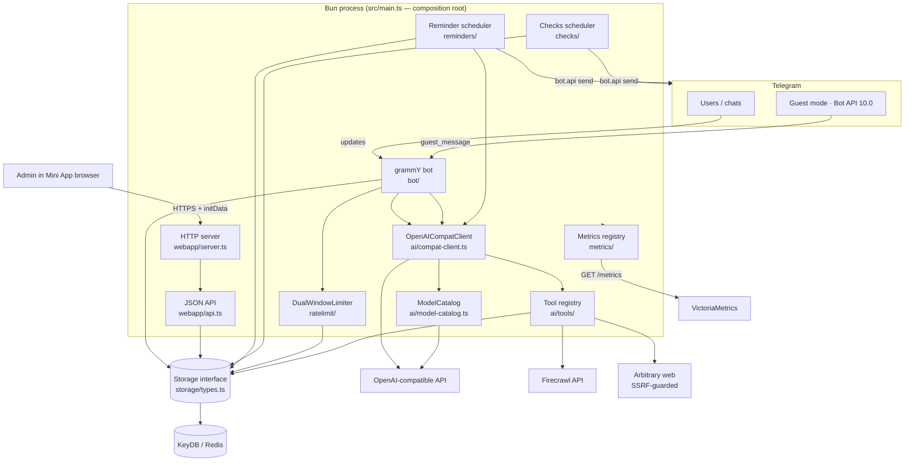
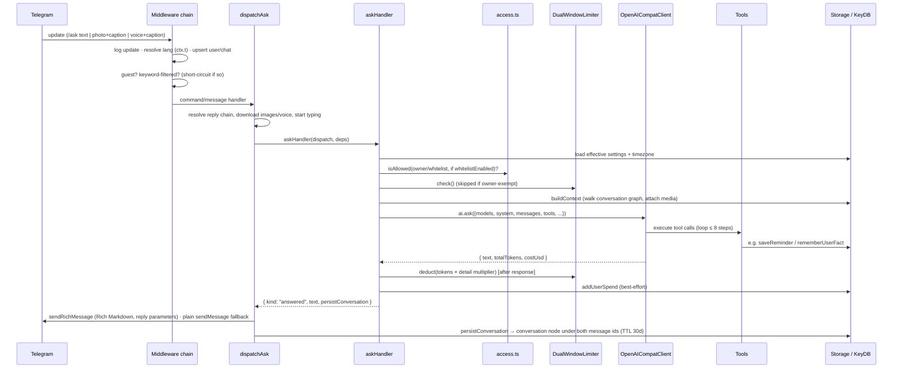
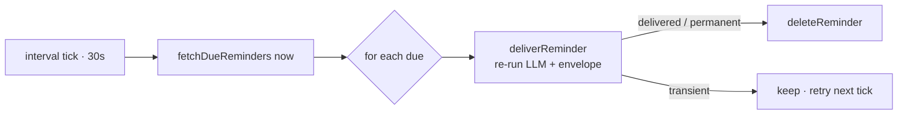

<!--
SPDX-License-Identifier: AGPL-3.0-or-later
Copyright (C) 2026 The Fisher Slopworks Co
-->

# Architecture

> Source of truth for how `any_talker` is structured. Read this before any work
> that touches architecture, adds a module, or crosses a component boundary.
> When you change the architecture, update this file in the same change (see the
> maintenance rule in `CLAUDE.md`).

## 1. Purpose

`any_talker` is a Telegram bot that answers questions with an LLM (via any
OpenAI-compatible API) and layers on conversational memory, scheduled reminders, recurring
check-ins, and per-user/per-chat administration. It is operated by a single
**owner** (`BOT_OWNER_ID`) for a whitelist of users and chats; all configuration
is done from a Telegram Mini App served by the bot itself.

## 2. Overview

A single Bun process (`src/main.ts`) is the composition root. It loads config,
constructs the shared services — `KeyDBStorage`, `DualWindowLimiter`,
`SpendBudgetGuard`, `ModelCatalog`, `OpenAICompatClient` — registers the AI
tools, then starts five long-lived things:

1. **The grammY bot(s)** in long-polling mode — receives Telegram updates, runs
   the `/ask` and guest-mode flows, photo/voice/contact handlers, and the
   recurring check inline-button callbacks. A `BotManager` (`managed-bots/`) runs
   **additional character bots** the owner created via the Bot API 9.6 Managed
   Bots flow — each its own token, avatar, name, system prompt, reminders and
   per-character memory, answering only when addressed as `/ask@its_username`.
2. **An HTTP server** (`Bun.serve`) — serves the React admin Mini App, a JSON
   `/api/*` surface, `GET /metrics` (Prometheus), and `GET /health`.
3. **The reminder scheduler** — polls KeyDB for due reminders and delivers them.
4. **The checks scheduler** — fires recurring daily check-ins and times them out.
5. **The observability scheduler** — scans for spend spikes and sends the
   periodic budget digest to the owner (`observability/`).

Everything persists through one `Storage` interface backed by **KeyDB** (a
Redis-compatible store) in production and an in-memory double in tests. The AI
layer wraps the **Vercel AI SDK** + the **`@ai-sdk/openai-compatible` provider**
(pointed at any OpenAI-compatible endpoint via `OPENAI_BASE_URL`) and exposes a
registry of tools the model can call. A `ModelCatalog` fetches the endpoint's
`/v1/models` for the admin picker and for per-request cost. Cross-cutting
concerns (config, logging, metrics, i18n, proxy) are small standalone modules
injected where needed.

There is **no build step**: Bun executes the TypeScript directly. The React Mini
App is bundled at serve time via Bun's HTML-import mechanism + `bun-plugin-tailwind`.

Key conventions that shape the whole codebase:

- **Dependency injection** — `createBot(deps)` / `startServer(deps)` and the
  schedulers take injected `storage`, `ai`, `rateLimiter`. Handlers are pure
  functions of their inputs.
- **Tagged outcomes** — bot handlers return discriminated `{ kind: ... }` objects
  (e.g. `"answered" | "denied" | "rateLimited" | "usage" | "error"`); the
  dispatcher owns all Telegram sends by switching on `kind`. The HTTP API uses
  the parallel `{ status, body }` shape.
- **Schema-on-read** — there are no migration files; stored records are
  normalized/backfilled when read (`normalize()` for settings, Zod
  `StoredReminderSchema` for reminders, `parseCheckJson` for checks).

## 3. System diagram

## 4. Directory / module map

| Path | Responsibility | Key files |
|---|---|---|
| `src/main.ts` | Composition root: load config, wire services, register tools, start bot + HTTP + schedulers; hot-reload teardown. | `main.ts` |
| `src/config.ts` | Env-var loading & validation → `Config`. | `config.ts` |
| `src/bot/` | grammY bot, middleware chain, dispatchers, handlers, voice transcoding, Telegram formatting. | `index.ts`, `handlers/{ask,guest,contact,check-callback}.ts`, `access.ts`, `context-builder.ts`, `transcode.ts`, `format.ts`, `rich.ts`, `html.ts`, `media-group-buffer.ts` |
| `src/bot/middleware/` | Per-update middleware: language resolution, keyword auto-delete. | `lang.ts`, `keyword-filter.ts` |
| `src/ai/` | OpenAI-compatible client, model catalogue + pricing, system-prompt builder, message (de)serialization, AI types. | `compat-client.ts`, `model-catalog.ts`, `instruction.ts`, `serialize.ts`, `types.ts` |
| `src/ai/tools/` | Tool registry + `withLogging` wrapper + SSRF-safe HTTP + each tool. | `registry.ts`, `logging.ts`, `http.ts`, `search-web.ts`, `fetch-page.ts`, `calculator.ts`, `currency-convert.ts`, `youtube-transcript.ts`, `user-facts.ts`, `user-settings.ts`, `reminders/` |
| `src/managed-bots/` | Owner-created character bots (Bot API 9.6): lifecycle manager, persona resolver, native-creation handling, avatar + input validation. | `manager.ts`, `persona.ts`, `avatar.ts`, `validate.ts`, `types.ts` |
| `src/storage/` | `Storage` interface (+ per-character `forBot` scoping) + KeyDB impl (prod) + in-memory double (tests). | `types.ts`, `keydb.ts`, `memory.ts` |
| `src/webapp/` | HTTP server, JSON API, Telegram initData auth, model-catalogue route. | `server.ts`, `api.ts`, `auth.ts` |
| `src/webapp/ui/` | React + Tailwind admin Mini App (views, components, api client, i18n). | `app.tsx`, `api-client.ts`, `views/`, `components/`, `lib/` |
| `src/reminders/` | One-shot reminder scheduling, delivery (re-runs the LLM), stored-record validation. | `scheduler.ts`, `delivery.ts`, `parse.ts`, `types.ts` |
| `src/checks/` | Recurring daily check-ins: schedule math, firing, resolution, counters. | `runner.ts`, `schedule.ts`, `resolve.ts`, `counter.ts`, `validate.ts`, `format.ts`, `callback-data.ts` |
| `src/ratelimit/` | Per-user dual fixed-window rate limiter (5-hour + weekly token budgets, per-user phase-shifted). | `dual-window.ts`, `window.ts`, `types.ts` |
| `src/budget/` | Hard USD budget guard — the enforcement safety net that denies non-owner requests when a global/chat/new-user spend cap is breached. Port + impl, mirroring `ratelimit/`. | `guard.ts`, `types.ts` |
| `src/spending/` | UTC-day-bucketed spend windows (per-user/chat/global/model), the multi-ledger spend recorder, and the shared spend-overview aggregator (powers the digest + dashboard). | `window.ts`, `record.ts`, `overview.ts` |
| `src/observability/` | Budget observability: pure spike detection, the owner digest formatter, the narrow owner-DM `NotifyApi`, and the scan+digest scheduler. | `spike.ts`, `digest.ts`, `scheduler.ts`, `types.ts` |
| `src/settings.ts` | Global/per-chat settings load, normalize, and override merge. | `settings.ts` |
| `src/metrics/` | Hand-rolled Prometheus registry + every instrument. | `registry.ts`, `instruments.ts`, `index.ts` |
| `src/shared/` | i18n catalog, timezone math, display-name validation, user-fact key/value constraints, interval scheduler, shared domain types. | `i18n.ts`, `tz.ts`, `display-name.ts`, `user-facts.ts`, `interval-scheduler.ts`, `types.ts` |
| `src/log.ts` · `src/proxy.ts` · `src/build-info.ts` | Structured logging, HTTP-proxy resolution, version/git metadata. | — |
| `src/types/` | Ambient declarations (Bot API 10.0 guest mode + 10.1 rich messages; HTML/CSS module imports). | `telegram-guest.d.ts`, `telegram-rich.d.ts`, `html-modules.d.ts` |

## 5. Core components

### Composition root — `src/main.ts`
Wires everything in order: `loadConfig()` → `KeyDBStorage.connect()` →
`DualWindowLimiter` → `createModelCatalog()` (warmed) → `OpenAICompatClient` → register tools (each wrapped in
`withLogging`) → `createBot()` → `deleteWebhook` + `syncBotCommands` →
`bot.start()` (long polling, `allowed_updates` extended with the custom
`guest_message`) → `startServer()` → `startScheduler()` + `startChecksScheduler()`.
`search_web` and `youtube_transcript` are only registered when
`FIRECRAWL_API_KEY` is set. `import.meta.hot.dispose` stops all handles on
hot-reload. **Depends on:** nearly every subsystem. **Depended on by:** nothing
(entry point).

### Bot — `src/bot/`
`createBot(deps)` builds the grammY `Bot` and registers a middleware chain whose
order is the request lifecycle (see §6). Two dispatchers convert handler outcomes
into Telegram sends:
- `dispatchAsk` — the `/ask` (`short`) and `/askwise` (`wise`) flows; resolves
  reply context, downloads images/voice, starts a typing indicator, calls
  `askHandler`, and on `"answered"` sends the Rich Markdown reply via Bot API
  10.1 `sendRichMessage` (plain `sendMessage` fallback) and persists the
  conversation node.
- `dispatchGuest` — Bot API 10.0 guest queries; mirrors the ask flows:
  downloads the query's own photo/voice (voice transcoded ogg→mp3), resolves
  reply context (the stored guest thread for a reply to this bot's own answer,
  otherwise the replied-to message — text and media — via the same
  unknown-reply fallback `/ask` uses), and replies once via the raw
  `answerGuestQuery` API call, carrying the answer as a Bot API 10.1
  `InputRichMessageContent` (Rich Markdown). Telegram delivers only the album
  message that carries the mention caption — sibling album messages produce no
  guest update at all (verified live) — so an album resolves to at most its
  single embedded photo and the album index is never populated for guest chats.

Handlers (`handlers/`) are pure and return tagged outcomes. `access.ts` is the
bot-side authorization gate (owner / user-whitelist / chat-whitelist), consulted
after settings resolve and only while `settings.whitelistEnabled` — a single
admin toggle that opens the bot to everyone (leaving the budget guard + rate
limit as the protection) without discarding the whitelist entries. AI replies
are **Rich Markdown** (Bot API 10.1): the model emits Markdown (see
`ai/instruction.ts`), `format.ts:buildRichMarkdown` assembles the payload
(bot-name prefix + effects block as escaped Rich HTML, long answers collapsed
into a `
` block, 32768-char truncation), and `rich.ts` sends it via
`sendRichMessage` — reached through `api.raw` since it postdates the installed
grammY — with a plain `sendMessage` fallback on error. `html.ts` now only
HTML-escapes those controlled fragments (and the check-in mentions); there is no
longer an output sanitizer because Telegram parses the Rich Markdown server-side. `createBot` is
parameterized by a `resolver` (the persona), an optional `persona` (`{botId}`),
and an optional `siblingBotIds`: when `persona` is present it is a **managed
bot** — it scopes per-character storage with `storage.forBot(botId)` and threads
`botId` into the tool call context.

**Ask routing (`matchAsk` + `askGate` + `classifyReplyTarget`).** All three are
pure. `matchAsk` (matched against the bot's live `ctx.me.username`, never a stale
one) parses `/ask(wise)` and returns `{detailLevel, userText, explicit}` — or
null for non-ask text / a mention to a *different* bot (this is what stops the
main bot stealing a `/ask@CharacterBot` caption). **Every** bot (main and
managed) parses text asks this way through a single `message:text` handler rather
than grammY's command filter, so the routing below is uniform across all bots.
`askGate` then decides from `explicit`, the bot's mode (`requireMention`), the
chat type, and where the ask *replies* (`classifyReplyTarget` → `self` |
`sibling` | `other`): an explicit `@self` is always answered; a bare `/ask`
**replying to a *present* family bot's message is routed to that bot** — the
replied-to bot answers (`self`), every other bot defers (`sibling` ⇒ `skip`), so
a bare `/ask` sent in reply to a character bot no longer falls through to the
main bot; otherwise the main bot answers a bare `/ask` everywhere, and a managed
bot answers a bare `/ask` only in its **DM** or in a group when it is the **only
family bot present** (`check-alone`).
`classifyReplyTarget` recognizes a family bot by the replied-to message's sender
id against this bot's `siblingBotIds` (the main bot is handed the managed-bot ids
by `BotManager.managedBotIds()`; a managed bot gets the main bot + its other
siblings), with its own id matched separately — **but only counts it as a
`sibling` when that bot is actually *present* in this chat** (a fresh
`bot_presence` record). A reply to a family bot that has left / been removed / is
down reads as `other`, so the ask falls back to normal routing (the main bot
answers) instead of being deferred into silence. Every bot (main and managed)
records its own group membership — authoritatively on `my_chat_member`, and
refreshed on genuine activity (`shouldRefreshPresence`: content messages only,
never the service/membership burst a bot drains around its own removal) — into a
shared `bot_presence` registry; `shouldAnswer` reads it once per ask and reuses
it for both the reply classification and `computeAlone`'s `check-alone` decision.
Managed bots also `syncBotCommands` for their own `/ask` menu, and carry **no
bold name prefix** (a managed bot *is* the character — `resolver` returns a null
`botName`). **Depends on:** `ai`, `storage`, `ratelimit`, `settings`, `managed-bots`
(persona), `shared/i18n`, `metrics`, `checks/resolve`. **Depended on by:**
`main.ts`, `managed-bots/manager`.

### Managed bots — `src/managed-bots/`
`BotManager` owns the lifecycle of every owner-created character bot: it loads
them at boot, starts/stops individual long-polling loops as the owner creates
(via the native `managed_bot` update → `getManagedBotToken`) or deletes them, and
stops all on hot-reload. Each managed bot is a full `createBot` instance with its
own token and update stream. `persona.ts` resolves the character per turn — for a
managed bot the main bot's **global** settings with the character's own
`systemPrompt`/name substituted in (per-chat overrides deliberately ignored);
`avatar.ts` wraps `setMyProfilePhoto`; `validate.ts` mirrors the Checks input
validator. The single reminder scheduler iterates `BotManager.reminderRuntimes()`
(plus the main runtime) so each character's reminders fire from the right
identity and persona. **Depends on:** `bot`, `storage`, `ratelimit`, `ai`,
`reminders` (runtime type), `proxy`. **Depended on by:** `main.ts`, `webapp`
(admin CRUD via a narrow `ManagedBotController`).

### AI layer — `src/ai/`
`OpenAICompatClient.ask(...)` wraps the Vercel AI SDK `generateText` + the
`@ai-sdk/openai-compatible` provider, pointed at `OPENAI_BASE_URL`. It sends only
`models[0]` (a generic endpoint has no server-side fallback chain),
passes `reasoningEffort` as a provider option (→ the standard `reasoning_effort`
body field), maps domain messages to SDK messages (text/image/audio), and runs
the tool-calling loop bounded by `stepCountIs(8)`. It returns
`{ text, totalTokens, costUsd }`, where `costUsd` is computed **locally** from
`inputTokens × promptPrice + outputTokens × completionPrice` using prices from
`ModelCatalog` (0 when the model is unpriced). `model-catalog.ts`
(`createModelCatalog`) fetches `GET {OPENAI_BASE_URL}/models` (TTL-cached),
normalizes both bare-OpenAI and richer-gateway shapes into `ModelInfo`, and
exposes a `PriceLookup` port to the client, `list()` to the `/api/models` route,
and `unknownModels()` so write routes can reject model ids absent from the
catalogue (both degrade to "allowed" when the catalogue is empty/unavailable). `instruction.ts` builds the (Russian) system prompt and defines the
`DetailLevel` multipliers; `serialize.ts` converts messages to/from a base64-safe
form for storage inside reminders. **Depends on:** `proxy`, `metrics`, `shared`,
`storage` (via tools). **Depended on by:** `bot`, `reminders/delivery`, `webapp`
(catalogue route).

### Tools — `src/ai/tools/`
`registry.ts` defines the `Tool` contract (`name`, `description`, Zod
`parameters`, `execute(input, ctx)`) and a process-wide singleton registry.
`withLogging` (`logging.ts`) wraps every tool with structured logging + metrics.
`http.ts` provides `safeFetch` — **SSRF-hardened**: DNS-resolves to a public IP,
blocks private/loopback/link-local ranges, pins the connection to the validated
IP (defeating DNS rebinding), re-validates redirects, and allow-lists
http/https + ports 80/443. Tools: `random_number`, `random_choice`,
`calculator` (hand-written parser, no `eval`), `currency_convert`, `fetch_page`
(Readability → Markdown), `youtube_transcript` + `search_web` (Firecrawl,
concurrency-bounded by `createSemaphore`), `user_facts`, the `user_settings`
tools, and the `reminders`
tools — `schedule_reminder_in`/`schedule_reminder_at` **create** reminders
(capped per user by `Settings.maxRemindersPerUser`), `list_reminders` returns the
user's pending reminders (soonest-first, bounded) — **scoped to the current chat**
in a group, but the user's **whole list** in a private DM (the management hub),
`edit_reminder` changes a
reminder's note and/or fire time by id after an O(1) ownership check (no cap
re-check; the count is unchanged), and `cancel_reminder` deletes one by id after
the same O(1) check; firing lives in `src/reminders/`.
`user-settings.ts` exposes `get_user_settings` (reads the effective name/timezone/
gender/language plus an `isDefault` flag per field) and `update_user_settings`
(partial, all-or-nothing write of any subset, with a `clear` list to reset a field
to its default). It validates before writing — `validateDisplayName` for the name,
`canonicalizeTimezone` for the zone (the storage setter does no validation of its
own) — and pushes a `settings_updated` `ToolEffect` rendered as a confirmation
blockquote (`bot/format.ts`). These four attributes are **user-global** (not
`forBot`-scoped). A change is persisted immediately and also written back into
the turn's shared `ToolCallContext` (`ctx.timezone`/`ctx.lang`), so a later tool
call in the same reply — e.g. scheduling a reminder for the just-set zone —
uses the new value rather than the snapshot resolved at the start of the turn.
**Depends on:** `storage` (facts/reminders/attributes), `proxy`, `metrics`, Firecrawl/web.
**Depended on by:** `ai/compat-client` (via `getAllTools()`), `main.ts` (registration).

### Storage — `src/storage/`
`types.ts` is the single `Storage` interface (settings, whitelist, per-user
rate-limit usage, per-user attributes, spending, users/chats directories,
chat settings, conversation graph, photo cache, albums, guest threads, reminders,
checks, user facts). `keydb.ts` implements it over Bun's `RedisClient`, with all
keys under the `at:` prefix and **server-side Lua (`EVAL`)** for the two
race-prone operations (usage accrual, fact upsert+evict).
`memory.ts` (`MemoryStorage`) mirrors the interface for tests. **Depended on by:**
essentially everything.

### Web App — `src/webapp/`
`server.ts` runs `Bun.serve`: static routes serve the React bundle (`import
indexHtml from "./ui/index.html"`); the `fetch` handler exposes `/metrics`,
`/health`, and unauthenticated `GET /api/build-info`, then gates all other
`/api/*` behind `Authorization: tma <initData>`. `auth.ts` verifies Telegram Web
App `initData` (HMAC-SHA256, constant-time compare, 24h freshness) — auth is
**stateless** (re-verified every request, no sessions). `api.ts` is a pure
`handleApi(req, deps, actor)` with a two-tier authorization model: user-scoped
routes, then `if (!actor.isOwner) return FORBIDDEN` gating all admin routes.
The user-scoped tier includes a per-character **memory vault**: `GET
/api/me/bots` lists the bot family as a narrow DTO (never the raw `ManagedBot`,
which carries `systemPrompt`/`ownerUserId`), and `GET|POST
/api/me/facts/:scope` + `PUT|DELETE /api/me/facts/:scope/:key` (scope =
`"main"` or a managed bot id, validated against the registry) let a user view,
add, edit, rename and delete the facts that character remembers about them,
through `storage.forBot(...)` — the same records the AI's
`remember_fact`/`forget_fact` tools maintain. Policy deliberately differs by
caller: the AI tool FIFO-evicts at the 50-fact cap, while the vault **rejects**
a new key at the cap (`limit reached`) and rejects a rename onto an existing
key (409) — an explicit user action must never silently destroy a memory (the
reminders-cap rationale). Key/value constraints live in
`shared/user-facts.ts`, the single source of truth shared by the tool's Zod
schemas and the API's hand-rolled validators.
The admin-only `GET /api/models` route serves the `ModelCatalog` to the
admin model picker (the browser can't hit a keyed/non-CORS endpoint
directly), which uses it for `<datalist>` autocomplete and to flag unknown ids;
the model-writing routes (`PUT /api/settings`, `/api/admin/chats/:id`)
re-validate against the catalogue (`unknownModels`) and 400 on
an id not in `/v1/models`. The React UI (`ui/`) is a state-machine SPA (no URL router) using
local state + a `useLoadable` hook; the Telegram `BackButton` drives navigation.
See §6 for the request flow. **Depends on:** `storage`,
`rateLimiter`, `settings`, `build-info`, `metrics`, `ai/model-catalog`.
**Depended on by:** `main.ts`; the React UI is the sole client of the JSON API.

### Schedulers — `src/reminders/`, `src/checks/`
Both are thin adapters over `shared/interval-scheduler.ts` (fire immediately,
then on an interval; skip — never queue — a tick if the previous is still
in-flight; default 30 s). The **reminder** scheduler fetches due reminders and
delivers each; `deliverReminder` **re-runs the LLM** with the stored context plus
a `reminder_fired` envelope (it is not a stored-text echo), giving at-least-once
delivery. The **checks** scheduler fires recurring daily questions with yes/no
inline buttons, times them out, and resolves them (also reachable via the
button-press callback through `bot/handlers/check-callback.ts`).
**Depends on:** `storage`, `bot.api`, `ai` (reminders only), `shared/tz`,
`shared/i18n`, `metrics`. **Depended on by:** `main.ts` (started at boot);
`checks/resolve` is also called from the bot's check-callback handler.

### Cross-cutting — `config`, `proxy`, `log`, `metrics`, `shared/i18n`
`config.ts` validates env into `Config`. `proxy.ts` resolves
`HTTP_PROXY`/`HTTPS_PROXY`/`NO_PROXY` and injects `proxiedFetch` into grammY (Bun
fetch is already proxy-aware for everything else). `log.ts` emits JSON or pretty
logs. `metrics/` is a from-scratch Prometheus implementation (no `prom-client`)
with cardinality-bounded labels. `shared/i18n.ts` is a compile-time-exhaustive
`en`/`ru` string catalog surfaced as `ctx.t`.
**Depends on:** the Bun runtime and env only (these are leaf modules).
**Depended on by:** nearly every other component — `config` by `main.ts`,
`metrics` by all instrumented paths, `i18n` by the bot/handlers/web UI, `proxy`
by grammY, `log` by the bot and tools.

## 6. Runtime / data flow

### `/ask` end to end

Notes that matter:
- The **middleware order is the lifecycle**: log → language → user/chat upsert →
  guest short-circuit → keyword-filter short-circuit → handlers. Guest and
  keyword-filtered messages never reach the normal handlers.
- Rate limiting is **per user and global** (one budget across all chats and
  family bots), enforced as **two fixed windows** — a 5-hour and a weekly token
  budget; a request is allowed only while **both** have budget left. Each user's
  window boundaries are **phase-shifted** by a deterministic offset (quantized to
  10-minute slots) derived from the user id, so resets are staggered across users
  rather than all landing on the same wall-clock boundary. **Deduction happens
  after** the AI responds and is not floored, so one request can overshoot a
  window's budget (at-least-one-more-request semantics). Owner-exempt
  requests skip the limiter entirely.
- The **budget guard** runs as a second, independent gate right before the token
  limiter (after settings resolve, since it needs `settings.budget`): it denies
  (`kind: "budgetLimited"`) when a global/chat/new-user USD cap is breached. Both
  the budget and rate-limit denial paths bump the per-user denial counter, and a
  global-cap breach fires a deduped owner DM from the dispatcher. On a successful
  answer, `spending/record.ts` books the cost to the user/chat/global/model
  ledgers (the global total drives the kill-switch).
- **Conversation context** is a reply-chain graph: each turn is stored as a
  `ConversationNode` with a `parentBotMsgId` pointer, written under **both** the
  bot's reply message id and the user's ask message id (unique within a chat),
  so replying to either side's message walks the chain to rebuild context.
  Turns the AI never answered — rate-limited or provider-error — are persisted
  too, with the failure notice that was sent as the stored answer, so a failed
  turn never severs the chain. In group
  chats the graph is **shared across the whole bot family**, so a reply across
  bots (`/ask@OtherBot` on another character's message) carries the full chain;
  DMs stay per-character (see §7, "Cross-bot conversation context").

### Scheduler tick (reminders)

## 7. Data model & persistence

Production storage is **KeyDB** accessed through Bun's `RedisClient`; every key is
namespaced with the `at:` prefix. Values are JSON unless noted. There is **no
migration framework** — records are validated and backfilled on read. The main
persisted entities:

| Entity | Key pattern | Redis type | TTL | Shape (abridged) |
|---|---|---|---|---|
| Global settings | `at:settings` | string | — | `Settings` (systemPrompt, models[], rateLimit, budget, anomaly, timezone, maxRemindersPerUser, …) |
| Chat settings | `at:chat_settings:{chatId}` | string | — | partial `ChatSettings` overrides; key deleted when empty |
| Whitelist | `at:whitelist:{users\|chats}` | string | — | `WhitelistEntry[]` (`{id, label?}`) |
| Per-user rate-limit usage | `at:usage:{userId}` | string | ~9 days (week + slack) | `{ fiveHour: {windowStart, used}, weekly: {windowStart, used} }` (per-user, global; window phase derived from the user id) |
| User attributes | `at:user_{name,tz,gender,lang}:{userId}` | string (raw) | — | scalar strings, validated on read |
| Per-user spend | `at:spend:{userId}:{YYYY-MM-DD}` | float counter | 35 days | USD per UTC day (`INCRBYFLOAT`); summarized to day/week/month |
| Per-chat / global / per-model spend | `at:spend_chat:{chatId}:{date}` · `at:spend_global:{date}` · `at:spend_model:{modelId}:{date}` | float counter | 35 days | Same day-bucket shape as per-user spend, written alongside it by `spending/record.ts`. Global is the kill-switch's source of truth. |
| Spend model directory · unpriced models | `at:spend_models` · `at:unpriced_models` | SET | — | Every model id that recorded spend · models that answered without pricing (spend under-counted) |
| Active spenders (per day) | `at:spend_active:{user\|chat}:{date}` | SET | 2 days | Ids that actually spent that day; bounds the spike scan to real spenders |
| Denial ranking (per day) | `at:denial_rank:{date}` | ZSET | ~9 days | `userId → denial count` (`ZINCRBY`) — "who hits limits most"; Prometheus has no per-user label by design |
| Digest cadence | `at:digest_state` | string | — | `{ lastSentAtMs }` — gates the periodic digest and bounds "new since last digest" |
| Alert dedupe | `at:alert_claim:{key}` | string | caller TTL | `SET NX EX` one-shot claim: an alert (cap breach, spike, new group) is DM'd once per period, not per event |
| Users / chats directory | `at:users` · `at:chats` | hash | — | `User` / `Chat` per field, incl. `firstSeenAt` (legacy rows backfilled to epoch 0 on read ⇒ never "new") |
| Conversation node | `at:msg:{chatId}:{msgId}` — one node per turn, written under both the bot-reply id and the user's ask message id (DMs add the `mbot:{botId}:` scope; groups stay shared) | string | 30 days | `{ userQuestion, botAnswer, parentBotMsgId, ts, userImageFileIds? }`; failed turns store the rate-limit/error notice as `botAnswer` |
| Photo cache | `at:photo_cache:{fileId}` | base64 string | 7 days | raw bytes (TTL renewed on read) |
| Album photos | `at:album:{chatId}:{mediaGroupId}` | hash | 30 days | `messageId → fileId` |
| Guest thread | `at:guest_thread:{chatId}` | string | 30 days | `{ turns: [{userQuestion, botAnswer, userImageFileIds?}], ts }` |
| Reminder payload | `at:reminder:{id}` | string | — | `Reminder` (incl. serialized `contextMessages`) |
| Reminder indexes | `at:reminders:due` · `at:user_reminders:{userId}` | ZSET · SET | — | due-by-`fireAtMs` index · per-user id set |
| Recurring checks | `at:checks` | hash | — | `RecurringCheck` per field |
| User facts | `at:user_facts:{userId}` | hash | — | `key → value`, capped at 50 (Lua evicts oldest) |
| Private-chat flag | `at:user_private_chat:{userId}` | string `"1"` | — | presence sentinel |
| Managed-bot registry | `at:managed_bots` | hash | — | `ManagedBot` per `botId` (`{botId, ownerUserId, username, displayName, systemPrompt, createdAtMs}`) |
| Managed-bot token | `at:managed_bot_token:{botId}` | string (raw) | — | bot token (**plaintext**); never returned to the UI |
| Bot presence | `at:bot_presence:{chatId}` | hash | TTL-read (7 d) | `botId → last-seen ms` for every family bot in a group; drives the bare-`/ask` alone-check **and** reply-to-a-bot routing (defer only to a *present* bot). Shared (unscoped), like the registry. |

**Per-character scoping (`forBot`).** `Storage.forBot(botId)` returns a view that
namespaces a bot's per-character data under an `at:mbot:{botId}:` segment, while
leaving everything else (settings, whitelist, per-user rate-limit usage,
users/chats directory, spend, user attributes, photo cache, checks, the
managed-bot registry) shared.
`forBot(null)` is the main bot and yields the **legacy unprefixed keys verbatim**,
so existing data and call sites are unaffected. (Per-user rate-limit usage, like
settings/whitelist/spend, is **not** scoped — one budget per user across the
whole family.) The scoped entities are:
conversation nodes, reminders (payload + indexes), user facts, guest threads,
album buffers, and the private-chat flag — i.e. exactly the rows above whose keys
become `at:mbot:{botId}:msg:…`, `:reminder:…`, `:user_facts:…`, etc. for a managed
bot. (Critically, in DMs `chat.id == user.id`, so without this scoping two bots'
DM conversations and reminders would collide.)

**Cross-bot conversation context (group chats).** The conversation graph is the
one scoped entity with a deliberate exception: in a **group** chat it is
**family-shared** — stored in the main bot's namespace (`forBot(null)`)
regardless of which bot answers — so replying to *any* family bot's message and
addressing a *different* one (`/ask@OtherBot`) carries the full reply chain, and
the answering bot's new node links to the replied-to one across the bot boundary.
This is safe because Telegram message ids are unique across all senders within a
group. **DMs keep per-character scoping** (there `chat.id == user.id`, so two
bots' DMs share a chat id with independent message-id sequences and would
collide). The bot layer picks the right view via
`bot/context-builder.ts:conversationStorage(base, botId, chatId)`, which routes
group chats (negative `chatId`) to `forBot(null)` and private chats to
`forBot(botId)`; `askHandler` uses it for every conversation read/write while
keeping facts/reminders on the per-character view.

Migration approach (schema-on-read): `settings.ts:normalize()` backfills/repairs
settings (e.g. legacy scalar `model` → `models[]`); `reminders/parse.ts`
validates against a Zod `StoredReminderSchema` and quarantines corrupt records;
`keydb.ts:parseCheckJson` backfills new check fields for legacy rows.

## 8. External integrations & key dependencies

**Third-party services**
- **OpenAI-compatible API** (configured via `OPENAI_BASE_URL`) — the LLM endpoint
  (chat completions via `@ai-sdk/openai-compatible`); its `GET /v1/models` is also
  proxied through the backend for the Mini App model picker and read for per-request
  cost. Any compliant endpoint works: OpenAI, a self-hosted gateway (LiteLLM, vLLM), etc.
- **Firecrawl** — powers `search_web` and `youtube_transcript` (optional; gated
  on `FIRECRAWL_API_KEY`).
- **Telegram Bot API** — via grammY (long polling) plus raw calls for file
  download, the Bot API 10.0 `answerGuestQuery`, and the Bot API 10.1
  `sendRichMessage` used for all AI replies (`api.raw`, since both postdate the
  installed grammY typings).
- **KeyDB** — Redis-compatible primary datastore (Lua scripting relied upon).
- **currency-api (jsDelivr)** — exchange rates for `currency_convert`.
- **VictoriaMetrics / VictoriaLogs / Vector** — prod observability stack
  (scrape `/metrics`, ship JSON logs).
- **Caddy + Let's Encrypt** — sole public ingress / automatic TLS in prod.

**Libraries that shape the architecture**
- `grammy` — Telegram framework (composer, middleware, context).
- `ai` (Vercel AI SDK) + `@ai-sdk/openai-compatible` — tool-calling loop and
  provider abstraction; the AI layer is built around these.
- `ffmpeg` (system binary; `apk add` in the Docker image) — transcodes Telegram
  ogg/opus voice notes to mp3 before they're sent as `input_audio`.
- `zod` — tool parameter schemas and stored-reminder validation.
- `@mozilla/readability` + `linkedom` + `turndown` — `fetch_page` HTML → Markdown.
- `react` + `react-dom` + `tailwindcss` (v4) + `bun-plugin-tailwind` — the Mini App.

## 9. Cross-cutting concerns

- **Authorization** — two gates rooted in `BOT_OWNER_ID`. Bot side:
  `bot/access.ts` (owner or whitelisted user or whitelisted chat). Web App side:
  `webapp/auth.ts` verifies signed Telegram `initData`, then `server.ts` derives
  `actor = { userId, isOwner }`; `api.ts` enforces user-vs-owner tiers.
- **Configuration** — all env reads funnel through `config.ts` (plus `NODE_ENV`,
  the proxy vars, `BOT_VERSION`, and `GIT_COMMIT` read elsewhere). Bun auto-loads
  `.env`; there is no dotenv dependency.
- **Logging** — `log.ts` emits structured JSON (prod) or pretty lines (dev);
  used by update logging, the tool `withLogging` wrapper, and debug logging.
- **Metrics** — a custom Prometheus registry (`metrics/`) exposed at
  `GET /metrics`; labels are allow-listed/normalized to bound cardinality. See
  the metric catalog in `README.md`.
- **Error handling** — expected business failures are encoded as tagged outcomes
  (`{kind}` for the bot, `{status, body}` for the API), not exceptions; true
  errors propagate and are caught at `bot.catch`, the scheduler tick guard, and
  the HTTP `fetch` wrapper. Side-effects (upserts, spend, photo cache) are
  fire-and-forget with `.catch` logging.
- **Input safety** — `safeFetch` SSRF guard for tool fetches; AI replies are
  Rich Markdown parsed server-side by Telegram (only supported tags and link
  schemes — `http(s)`/`mailto`/`tel`/`tg://user`, never `javascript:` — are
  honored), with the bot-injected fragments (name, effects line, `
`
  summary) HTML-escaped via `html.ts`; `shared/display-name.ts` prompt-injection
  blocklist; fact values whitespace-collapsed before prompt injection.
- **i18n** — `en`/`ru` only; a compile-time-exhaustive catalog in
  `shared/i18n.ts`, resolved per-update by `bot/middleware/lang.ts` and used as
  `ctx.t`. Never hardcode user-facing strings.

## 10. Build, run & deploy

- **No build step.** Bun runs the TypeScript directly; `tsconfig.json` is
  `noEmit` (typecheck only). The Mini App is bundled at serve time.
- **Local:** `bun install`, `docker compose up -d` (KeyDB), then `bun run dev`
  (`bun --hot ./src/main.ts`). `bun run check` (typecheck + tests) before every
  commit.
- **Container:** multi-stage `Dockerfile` on `oven/bun:1-alpine`
  (`deps` installs `--frozen-lockfile --production`, `release` copies source,
  runs as `USER bun`, `EXPOSE 8080`, `HEALTHCHECK` on `/health`).
- **Prod:** `docker-compose.prod.yml` runs the bot (pulled from GHCR), KeyDB
  (AOF+RDB), Caddy (the only service publishing 80/443), and the
  VictoriaMetrics/VictoriaLogs/Vector observability stack on an internal network.
- **CI/CD** (`.github/workflows/`): `ci.yml` runs typecheck + tests on every
  push/PR, then on `main` builds and pushes the image to GHCR (with `GIT_COMMIT`)
  and POSTs a deploy webhook. `pr-deploy.yml` builds a `:preview` image on a
  maintainer `/deploy` comment. `reuse.yml` enforces license/SPDX compliance.
- **Config sources:** `.env` (see `.env.example`) for required
  (`BOT_TOKEN`, `OPENAI_API_KEY`, `OPENAI_BASE_URL`, `BOT_OWNER_ID`) and optional
  vars; prod adds `DOMAIN`, `LETSENCRYPT_EMAIL`, retention, and proxy settings.

## 11. Testing strategy

- **Framework:** `bun test`. Tests are co-located as `*.test.ts` next to the
  code (≈59 test files), clustering in `ai/`, `bot/`, `checks/`, and `storage/`.
- **Test double:** `MemoryStorage` (`src/storage/memory.ts`) stands in for KeyDB;
  it mirrors the `Storage` interface 1:1 (including the Lua-backed atomic
  operations' observable behavior).
- **Style:** all in-process unit tests — no live KeyDB, no real network. The few
  fetch-based tools stub `globalThis.fetch`. Pure decision functions
  (`lastScheduledFireMs`, `currentCount`, `summarizeSpend`, `parseStoredReminder`,
  …) are separated from I/O specifically to be unit-testable. There is no
  separate integration/e2e tier and no shared fixtures directory.
- **Run:** `bun test` (all), `bun run typecheck`, or `bun run check` (both).

## 12. Key design decisions & trade-offs

- **Provider-neutral OpenAI-compatible client** — the AI layer targets any
  endpoint via `OPENAI_BASE_URL` + `@ai-sdk/openai-compatible`, not a specific
  gateway. Consequences of dropping OpenRouter-proprietary features: (1) **no
  server-side model fallback** — only `models[0]` is sent; (2) **no provider
  routing / service tier**; (3) **cost is computed locally** from the catalogue's
  per-token pricing (`PriceLookup`), degrading to $0 when the endpoint's
  `/v1/models` carries no pricing (a bare OpenAI list). The `ModelCatalog` is the
  single source for both the admin picker and cost, fetched server-side because a
  keyed/non-CORS endpoint can't be reached from the browser.
- **Voice transcoded to mp3 via ffmpeg** — the OpenAI-compatible `input_audio`
  field accepts only wav/mp3 (it throws on ogg), so Telegram voice notes are
  transcoded at the download boundary; a transcode failure drops the audio part
  rather than sending unusable ogg. Trade-off: a system `ffmpeg` dependency in
  the image.
- **Bun-native, no build step** — TypeScript runs directly and the Mini App is
  bundled on the fly; simpler pipeline, at the cost of tying the project to Bun.
- **DI + pure handlers + tagged outcomes** — every handler is a pure function
  returning a discriminated result, so the dispatcher owns I/O and tests use
  `MemoryStorage` without mocking Telegram. This is the single most pervasive
  pattern.
- **One `Storage` interface, two implementations** — swappable prod/test
  persistence; the in-memory double is the backbone of the test suite.
- **Schema-on-read instead of migrations** (inferred from the normalize/backfill
  code and the absence of any migration files) — new fields are tolerated on old
  records at read time; trade-off is that compatibility logic accumulates in the
  read paths.
- **Server-side Lua for atomic ops** — per-user usage accrual (with per-window
  roll-over) and fact eviction run as `EVAL` scripts so concurrent updates can't
  race; the in-memory double reproduces the same math.
- **Per-user dual fixed-window rate limit, phase-shifted per user** — chosen over
  the old per-(chat,user) token bucket so the weekly cap can't be sidestepped by
  switching chats. Window phase is a deterministic hash of the user id (quantized
  to 10-minute slots), so resets are staggered with **no stored offset** and no
  migration; `check` is a pure read and `deduct` is the only writer. Trade-off:
  there is no longer a per-chat rate-limit override (it can't compose with a
  global per-user budget).
- **Hard USD budget guard, separate from the token rate limit** (`budget/`) —
  money and fairness are different currencies and scopes, so the `BudgetGuard`
  (USD caps: global monthly/daily, per-chat daily, new-user soft-start) is a
  second, independent gate checked *before* the per-user token limiter, not
  folded into it. It exists so the whitelist can be turned off safely (the
  `whitelistEnabled` toggle): the token limiter bounds one user's *volume*, the
  budget guard bounds total *dollars*
  (an expensive model with few tokens still costs money). The **global monthly
  cap is the real kill-switch** (sized to the operator's actual budget); the
  daily/chat/new-user caps bound how fast it can drain. The owner is never denied
  (`ownerExempt`) but owner spend still counts toward the global totals. Caps are
  checked most-severe-first and are global policy (no per-chat override, same
  rationale as the rate limit). Spend is recorded across four ledgers
  (user/chat/global/model) by one `spending/record.ts` fan-out, so every LLM call
  site — `/ask`, guest mode, **and reminder delivery** (previously an untracked
  cost sink that re-ran the model with no accounting) — books cost the same way.
- **`firstSeenAt` backfilled to epoch 0, not "now"** — new-user detection needs a
  first-seen instant, added to `User`/`Chat`. Rows written before the field
  existed are treated as epoch 0 on read (and on their next upsert), so an
  existing user is never mistaken for "new" on deploy day — which would wrongly
  subject long-time users to the new-user soft-start cap or flood the digest.
  Schema-on-read, no migration. The upsert is a non-atomic read-merge (like the
  fire-and-forget upserts calling it); a rare concurrent double-`isNew` is
  tolerated because the new-group alert is `claimAlert`-deduped and the digest is
  `firstSeenAt`-derived.
- **Observability is derived, not queued** (`observability/`) — the periodic
  owner digest (new users/chats since last digest, top spenders, per-model spend,
  denial leaders, unpriced models) is re-projected from the persisted day-bucket
  counters + `firstSeenAt` at digest time, so there is no event log to maintain.
  Spend spikes (absolute OR velocity-vs-own-baseline) are found by a periodic
  scan bounded to today's active spenders, not computed on the hot path — the
  *enforcement* caps stay real-time (the guard re-reads storage per request), but
  the owner's *notification* of a spike lags by at most the scan interval.
  Delivery is hybrid: instant owner DMs for alarms (global cap breach, new group,
  spend spike, each `claimAlert`-deduped to once/period), a batched digest for
  routine reporting. All owner-facing surfaces (digest, dashboard) reuse one
  `spending/overview.ts` aggregator.
- **Custom Prometheus implementation** — `metrics/registry.ts` explicitly avoids
  `prom-client` (hand-rolled exposition + cardinality guards); fewer deps, more
  in-house code to maintain.
- **SSRF hardening for model-driven fetches** — because the LLM can choose URLs,
  `safeFetch` pins to validated public IPs and re-checks redirects.
- **At-least-once reminders that re-run the LLM** — delivery regenerates the
  message from stored context rather than echoing stored text, trading
  determinism/cost for freshness; non-transactional delete means possible
  duplicates over guaranteed delivery.
- **Per-user reminder cap + bounded list/edit/cancel tools** — users manage reminders
  conversationally via `list_reminders`/`edit_reminder`/`cancel_reminder`, but reminders carry no
  TTL and creation was previously unbounded, so a user could accumulate enough to
  blow the model context (a list tool result is fed back into the LLM uncapped)
  and make deletion an O(n²) grind. Three guardrails: (1) a configurable per-user
  cap (`Settings.maxRemindersPerUser`, default 50) enforced as **rejection, not
  eviction** in `persistReminder` — a reminder is a user-visible commitment, so
  silently dropping the oldest (as `user_facts` does) is wrong; enforcement is a
  check-then-save guardrail, not an atomic invariant, since a rare off-by-one over
  the cap is harmless. (2) `list_reminders` independently caps its result (soonest
  N, shortened notes) because nothing downstream bounds a tool result before it
  re-enters the model. In a group chat it also scopes the list to the **current
  chat** (reminders are stored per-user but each records its origin chat) so one
  chat's private notes never leak into another; in the user's **private DM**
  (`chatId == userId`) it returns the whole list, since there is no other audience
  and the DM is where the user manages everything — including guest-DM reminders
  (delivered there but recorded against the business chat they were created in)
  and reminders whose chat id changed under them (group→supergroup). This is a
  **display filter only**: `edit_reminder`/`cancel_reminder` gate solely on
  `userId` ownership, so a user can edit/cancel any reminder they own by id
  regardless of which chat surfaced it — the scoping does **not** carry to them.
  Note the per-user cap is counted across *all* chats while a group-chat list is
  scoped to one, so a user at the cap may see fewer here than the count implies;
  the DM shows the full list to reconcile them.
  (3) `cancel_reminder` and `edit_reminder` verify ownership and read the fire
  time via an O(1) `getReminder` (a single `GET`) instead of an O(n) list scan, so
  the per-call cost is constant. `edit_reminder` keeps the same `id` and the
  original conversation snapshot, overwriting via `saveReminder` (which upserts the
  due-index score), and re-checks the 1-minute lead only when the time changes.
  No blanket cancel-all verb exists — bounding the
  blast radius of an accidental "delete everything" — and the AI step loop is
  **not** the safeguard (parallel tool calls can fan out within a step).
- **Stateless Mini App auth** — `initData` is re-verified on every request (no
  sessions); simpler and tamper-evident, at the cost of per-request HMAC work.
- **Managed bots as N independent `Bot` instances** — each character is a real
  Telegram bot with its own token and update stream, driven by a shared
  `createBot` parameterized by persona; the alternative (one token impersonating
  many) is not possible in the Bot API. A `BotManager` owns their lifecycles.
- **Per-character storage via a `forBot(botId)` facade, not migrations** — chosen
  over threading a `botId` parameter through every storage method because the
  facade leaves all existing call sites and tests byte-identical (`forBot(null)`
  is the legacy keyspace); the one place scoping is manual — the global tool
  registry's `reminders`/`user_facts` tools — is covered by a tool-level
  isolation test. Persona is **per-bot** (name + prompt + memory + reminders);
  configuration (models, limits, provider) is **inherited from the main bot's
  global settings**, deliberately ignoring its per-chat overrides.
- **Reply-to-a-bot routing is gated on presence, and fails *open*** — a bare
  `/ask` sent *in reply to* a particular family bot's message is routed to that
  bot (the replied-to bot answers, every other family bot defers), so a user can
  address a specific character — or the main bot — by replying to one of its
  messages. The deferral is only taken when the replied-to bot is **present in
  this chat** (a fresh `bot_presence` record): a reply to a family bot that has
  left / been removed / is down reads as `other`, so the main bot still answers
  rather than deferring to a bot that will never see the update (the precise bug
  that made an earlier, presence-blind version go silent — it deferred on the
  *global* set of running bots regardless of chat membership). Hence this path
  fails **open** (unknown presence ⇒ the main bot answers), the deliberate
  *inverse* of the alone-check below: the failure it guards is silence, so its
  worst case is a rare one-off double-answer (a member bot whose presence has gone
  stale), self-healing on the next activity.
- **Bare-`/ask` alone-check via presence tracking, not `getChatMember`** — for a
  bare `/ask` that is *not* a reply to a present family bot, a managed bot answers
  in a group only when it is the sole family bot there. `getChatMember` would be
  authoritative but Telegram only guarantees it for *admin* bots, so a
  regular-member character bot couldn't probe its siblings. Instead each bot
  records its own membership (authoritative on `my_chat_member`, refreshed on
  activity) into a shared `bot_presence` registry, which works without admin.
  Trade-off: a rare one-off double-answer at cold start (a pre-existing chat right
  after deploy, before siblings re-register), self-healing on first activity; the
  alone-check fails **closed** (a storage error ⇒ stay silent) so it never
  double-answers the main bot.
